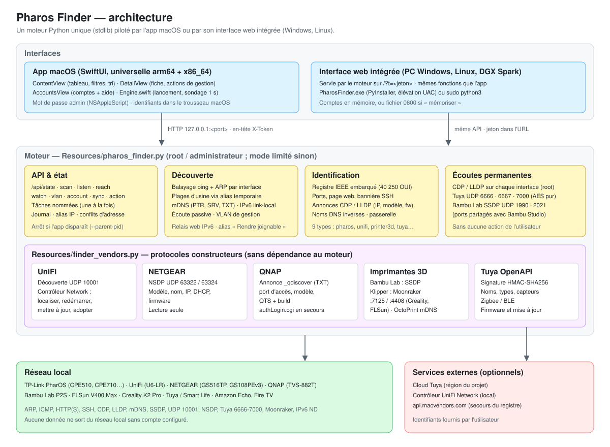
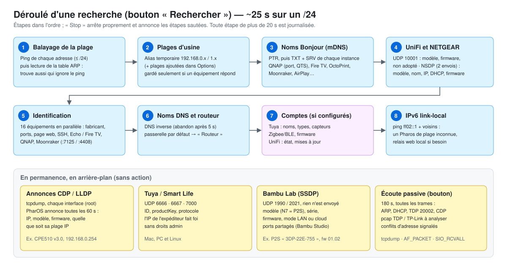
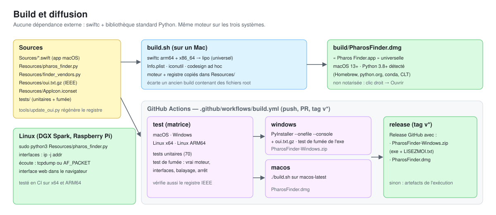

# Pharos Finder — macOS et Windows

Découverte et gestion réseau : **TP-Link PharOS** (CPE510, CPE710…), **UniFi**, **NETGEAR**, **QNAP**, **imprimantes 3D** (Bambu Lab, Klipper/Moonraker : Creality, FLSun… ; OctoPrint), **Tuya / Smart Life** et **Amazon** (Echo, Fire TV), plus tout appareil annoncé en Bonjour/mDNS.



| Déroulé d'une recherche | Build et diffusion |
|---|---|
|  |  |

App native (SwiftUI) pour découvrir les équipements **TP-Link PharOS** (CPE510, CPE710 et les autres CPE/WBS), les rendre joignables et ouvrir leur configuration. Inspirée de Pharos Control et de QNAP Finder.

## Construire le DMG (une seule fois, ~1 min)

```bash
cd PharosFinder
chmod +x build.sh
./build.sh --open
```

Résultat : `build/PharosFinder.dmg` (app universelle Apple Silicon + Intel, signée ad hoc). Ouvre le DMG et glisse **Pharos Finder** dans Applications.

Prérequis : Command Line Tools (`xcode-select --install`) et Python 3.8+ (Homebrew, python.org, conda ou celui des Command Line Tools). Aucun compte développeur Apple nécessaire.

## Windows (PC)

Télécharge `PharosFinder-Windows.zip` (onglet *Releases*, ou artefact de la dernière exécution *Actions*), décompresse, double-clique sur **PharosFinder.exe** et accepte la demande administrateur. L'interface s'ouvre dans le navigateur ; garde la fenêtre noire ouverte. Détails : `windows/LISEZMOI.txt`.

Sans l'exe (Python 3.8+ installé) : `python Resources\pharos_finder.py` dans une invite de commandes.

## Linux (DGX Spark, Raspberry Pi…)

```bash
sudo python3 Resources/pharos_finder.py
```

Ouvre l'URL affichée dans ton navigateur.

## Utilisation

1. Lance l'app : macOS demande ton mot de passe. Il sert à poser des adresses IP temporaires et à écouter le réseau. Si tu refuses, l'app fonctionne en mode limité.
2. Choisis l'interface reliée au Pharos dans la barre d'outils (● = câble actif).
3. Clique sur **Rechercher** (⌘R). L'app balaye ta plage et les plages d'usine PharOS (`192.168.0.254`).
4. Si le Pharos est dans une plage inconnue, clique sur **Écoute passive** (⌘L), puis débranche et rebranche son alimentation PoE.
5. Sélectionne l'équipement :
   - **Rendre joignable** s'il est hors de ta plage ;
   - **Ouvrir l'interface web** ou **SSH** pour y accéder ;
   - **Changer l'adresse IP** : modifie l'IP dans l'interface web, puis l'app suit la nouvelle adresse.

Les adresses temporaires apparaissent en bas à droite. Elles sont retirées à la fermeture, même si l'app plante.

## Architecture

- `Sources/` : interface SwiftUI (fenêtre, tableau, inspecteur, journal) et pilotage du moteur.
- `Resources/pharos_finder.py` : moteur de découverte (ifconfig, ARP, tcpdump, sondes web/SSH). Il est lancé avec les droits admin et écoute uniquement sur 127.0.0.1, protégé par un jeton aléatoire.
- Journal du moteur : menu **Réseau → Ouvrir le journal du moteur**.

## Conseil de branchement

Un Pharos neuf ou réinitialisé est en **192.168.0.254** sans DHCP. Depuis le Wi-Fi, beaucoup de points d'accès bloquent l'accès à cette adresse : relie l'injecteur PoE (port LAN) **directement** à la prise Ethernet du Mac/PC et choisis cette interface.

## Identification

| Type | Comment |
|---|---|
| PharOS | annonces CDP/LLDP (IP, modèle, firmware, toutes les 60 s), page web, SSH, fabricant |
| Tuya / Smart Life | annonces UDP 6666 (v3.1), 6667 (v3.3/3.4, AES-ECB), 7000 (v3.5, AES-GCM) : ID, productKey, version ; fabricant |
| Amazon | fabricant, puis Fire TV (`_amzn-wplay`, port 5555) ou Echo (ports 55442/55443/4070, Spotify Connect) |
| UniFi | découverte UDP 10001 (modèle, nom, firmware, état d'usine) ; avec le contrôleur : localiser, redémarrer, mettre à jour, adopter |
| NETGEAR | NSDP UDP 63322/63324 (modèle, nom, IP, DHCP, firmware) ; lecture seule |
| QNAP | annonce Bonjour `_qdiscover` (port d'accès réel, modèle, QTS, build — comme QNAP Finder) ; `authLogin.cgi` en secours |
| Imprimantes 3D | Bambu Lab : annonces SSDP UDP 1990/2021 (modèle, série, firmware, mode LAN/cloud) ; Klipper : Moonraker :7125/:4408 (Creality K1/K2, FLSun…) ; OctoPrint : mDNS |
| Tuya (compte) | noms, types (passerelle, prise, capteur…), capteurs Zigbee/BLE par passerelle, firmware et mise à jour ; aide intégrée (bouton **Comptes**) |
| Autres | nom Bonjour/mDNS (AirPlay, Chromecast, imprimantes…) |

## Limites

- Le protocole TDP de Pharos Control (UDP 20002) n'est pas documenté. L'app écoute ce trafic mais ne l'émule pas.
- La configuration se fait dans l'interface web PharOS (identifiants d'usine : `admin` / `admin`).
- Pour partager le DMG avec quelqu'un d'autre : au premier lancement, il faut faire clic droit → Ouvrir (app non notariée).

## Licence

Propriétaire — tous droits réservés. Voir `LICENSE`.
